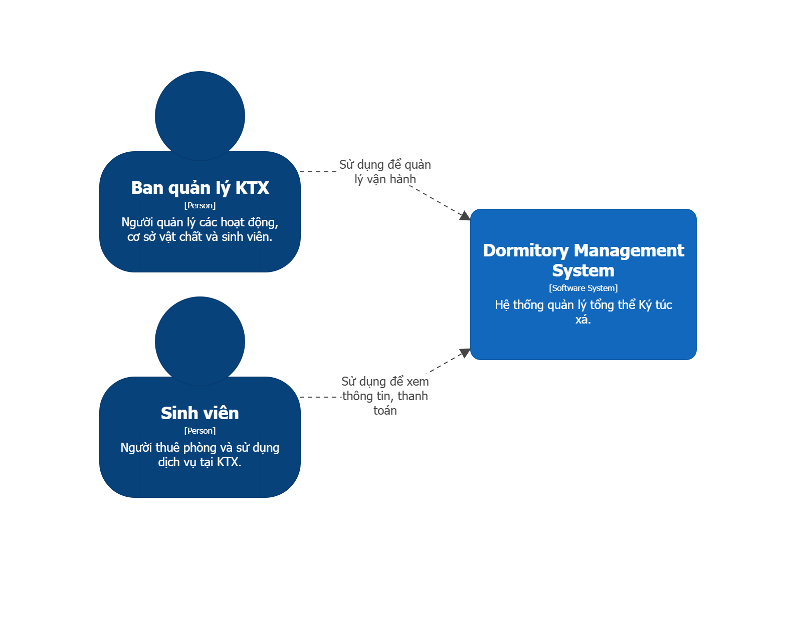
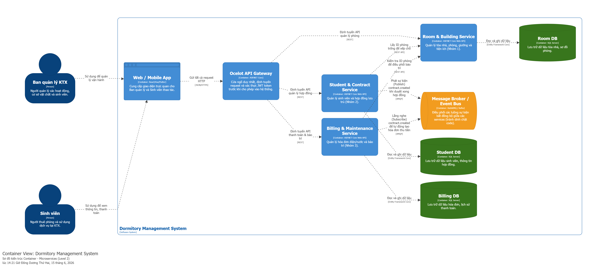

# DMS Fullstack (Dormitory Management System)

Đề tài: **Hệ thống Quản lý Ký túc xá Sinh viên**.

Dự án áp dụng kiến trúc Microservices trong một Monorepo theo đúng tiêu chuẩn kỹ thuật phân tán:

- **Frontend:** VueJS 3 + Tailwind CSS.
- **Backend:** ASP.NET Core Web API (.NET 9).
- **Database:** SQL Server.
- **API Gateway:** Ocelot (Xử lý JWT Token & Routing).
- **Event Bus:** RabbitMQ + MassTransit (Xử lý giao tiếp bất đồng bộ).
- **Môi trường:** Docker Compose.

## 1. Cấu trúc dự án (Monorepo)

Toàn bộ các nhóm làm việc trên chung một repository, sử dụng chung cấu trúc Hợp đồng dữ liệu (Contracts) nhưng phát triển các Service hoàn toàn độc lập:

```text
DMS-Solution-Base/
  frontend/                         # VueJS 3 App
  backend/
    gateway/                        # API Gateway (Ocelot - Port 5000)
    services/
      room-building/                # Nhóm 1 (Port 8080)
      student-contract/             # Nhóm 2 (Port 8081)
      billing-maintenance/          # Nhóm 3 (Port 8082)
  shared/
    contracts/                      # Class dùng chung (Event message, DTOs)
  infra/
    docker-compose.yml              # Cấu hình SQL Server + RabbitMQ + Services
  docs/                             # Tài liệu phân tích, C4 Model
```

## 2. Phân công thành viên & Nghiệp vụ

| Module | Nhóm phụ trách | Cơ sở dữ liệu | Nghiệp vụ cốt lõi |
| :--- | :--- | :--- | :--- |
| **Room & Building** | Nhóm 1 (Phong, Quang, Phong) | `RoomDB` | Quản lý Tòa nhà, Phòng, Giường. Cung cấp API check phòng trống. |
| **Student & Contract** | Nhóm 2 (Thành, Thuận, Trung) | `StudentDB` | Quản lý sinh viên, tạo hợp đồng thuê phòng. |
| **Billing & Maintenance** | Nhóm 3 (Tú, Phi, Quân) | `BillingDB` | Quản lý hóa đơn điện/nước. Xây dựng Background Service tính doanh thu. |

## 3. Kiến trúc hệ thống & Quy tắc cốt lõi

Hệ thống tuân thủ nghiêm ngặt các quy tắc thiết kế Microservices sau:

1. **Độc lập Database:** 3 Database riêng biệt. **Tuyệt đối không JOIN và không tạo khóa ngoại cứng (Foreign Key) chéo giữa các DB.** Tham chiếu chéo chỉ dùng ID (Ví dụ: `StudentDB` lưu `RoomId` dạng số nguyên). Kiểu dữ liệu của các trường tham chiếu phải đồng nhất 100%.
2. **API Gateway là duy nhất:** Mọi request từ ứng dụng VueJS hoặc request gọi đồng bộ giữa các Service (ví dụ Nhóm 2 gọi Nhóm 1) đều phải đi qua định tuyến của API Gateway. Gateway chịu trách nhiệm xác thực JWT Token.
3. **Giao tiếp bất đồng bộ (RabbitMQ):** Sử dụng thư viện **MassTransit**. Ví dụ: Nhóm 2 tạo Hợp đồng thành công -> Publish event `ContractCreated` -> Nhóm 3 consume event để tự động cập nhật bảng thống kê doanh thu.

### Sơ đồ System Context (Mức 1)


### Sơ đồ Containers (Mức 2)


## 4. Hướng dẫn chạy dự án

### 4.1. Chạy hạ tầng bằng Docker (Khuyên dùng)
Để đảm bảo môi trường đồng nhất, sử dụng Docker để khởi chạy SQL Server và RabbitMQ:
```bash
# Khởi động hạ tầng (RabbitMQ Management sẽ chạy ở port 15672)
docker compose -f infra/docker-compose.yml up -d
```

### 4.2. Chạy Local (Quá trình phát triển)
Các nhóm tự chạy Service của mình trên các port quy chuẩn sau:
- **API Gateway:** `http://localhost:5000`
- **Room Service (Nhóm 1):** `http://localhost:8083`
- **Student Service (Nhóm 2):** `http://localhost:8081`
- **Billing Service (Nhóm 3):** `http://localhost:8082`

> **Lưu ý test API:** Nhóm 1 và Nhóm 3 cần chuẩn bị sẵn Mock Data (dữ liệu giả lập) trả về chuẩn JSON để các nhóm khác có thể test `HttpClient` thông qua Gateway trước khi ghép nối hoàn thiện Database.

## 5. Quy trình làm việc với Git

Để tránh xung đột (conflict) mã nguồn, tất cả thành viên tuân thủ luồng làm việc:

1. **Làm việc trên nhánh tính năng riêng**:
   ```bash
   git checkout -b feature/[tên-nhóm]
   ```

2. **Đẩy code lên Repository**:
   ```bash
   git push origin feature/[tên-nhóm]
   ```

3. **Gộp code (Merge)**:
   Lên giao diện GitHub tạo **Pull Request (PR)** để các thành viên review chéo. **Nghiêm cấm push code trực tiếp vào nhánh master.**
